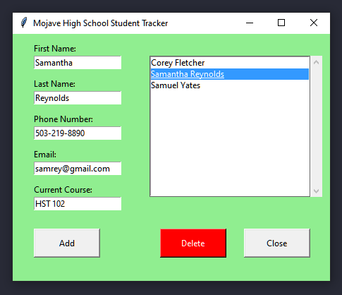

# Student Tracker
 
A Student Tracking System for administrative purposes. This demonstrates
OOP, Tkinter GUI module, and using Tkinter parent and child relationships.

Technologies used in creation:
- Python
- Tkinter

