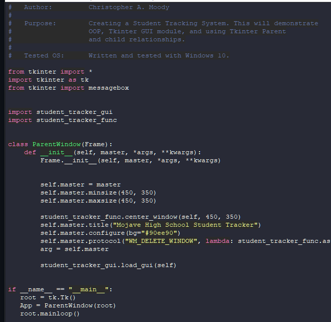
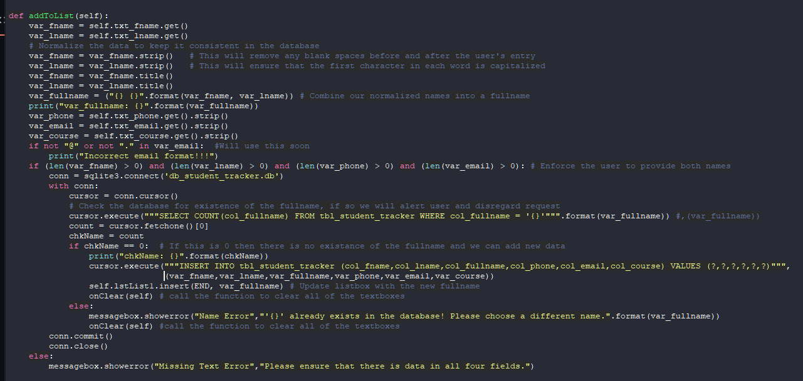
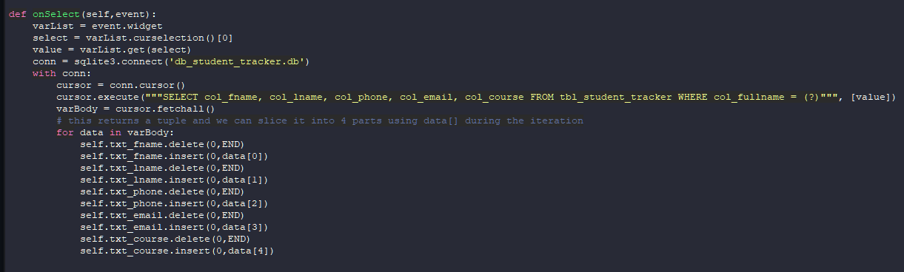
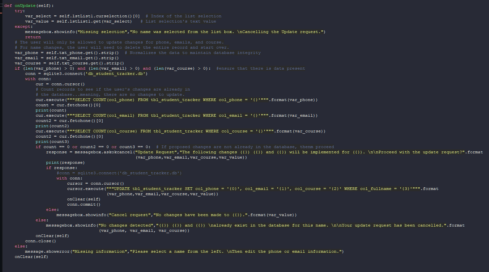
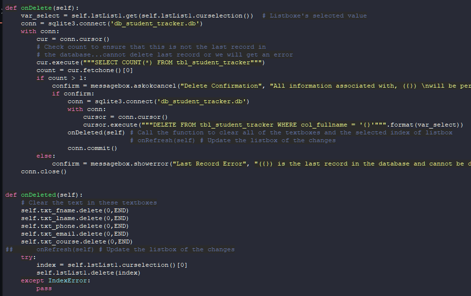

# Student Tracker
 
A Student Tracking System for administrative purposes. This demonstrates use of
OOP, SQLite3, the Tkinter GUI package, and Tkinter parent and child relationships.

Technologies used in creation:
- Python
- Tkinter
- SQLite3

 ## Table of Contents
 * [Window Manager](/README.md#window-manager)
 * [Geometry manager](/README.md#geometry-manager)
 * [CRUD Functionality](/README.md#crud-functionality)
 * [Closing Thoughts](/README.md#closing-thoughts)

## Window Manager
I started this project by creating the main app file which will handle rendering the GUI through the Window Manager. This class also handles the calling of the Geometry Manager.

## Geometry manager
This portion of the app handles the placement and contents of various widgets for the GUI.

## CRUD Functionality
Finally I implemented CRUD Functionality through the use of different functions.

### Create

### Read

### Update

### Delete

## Closing Thoughts
This project was a great way to exercise my GUI creation abilities and use of various widgets. If I were to expand this in the future, I would like to add the ablity to store a students full schedule with names of teachers for each class as well as other information like: grade level, GPA, and possibly individual class grades.
