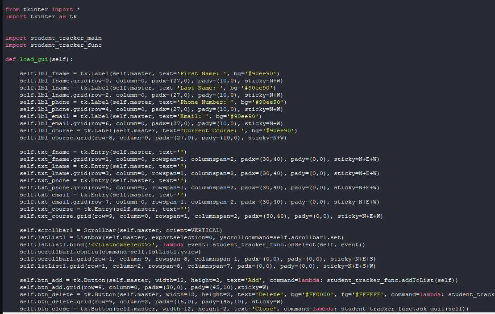

# Student Tracker
 
A Student Tracking System for administrative purposes. This demonstrates use of
OOP, SQLite3, the Tkinter GUI package, and Tkinter parent and child relationships.

Technologies used in creation:
- Python
- Tkinter
- SQLite3

## Window Manager
I started this project by creating the main app file which will handle rendering the GUI through the Window Manager. This class also handles the calling of the Geometry Manager.

## Geometry manager
This portion of the app handles the placement and contents of various widgets for the GUI.

## CRUD Functionality
Finally I implemented CRUD Functionality through the use of different functions.

### Create

### Read

### Update

### Delete

